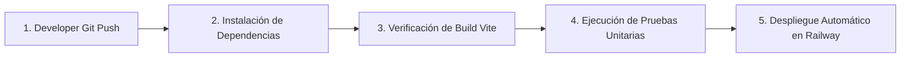

# 🌐 Onvia Web — Marketplace & Conector B2B de Negocios, Servicios y Proveedores

> **Documento de Presentación y Especificación Técnica del Proyecto**  
> *Preparado para Coordinación de Proyecto, Desarrollo Fullstack y DevOps.*

---

## 📌 1. Visión General del Proyecto

**Onvia Web** es una plataforma web integral diseñada para conectar directamente a **emprendedores, proveedores de insumos, prestadores de servicios y clientes**. 

A diferencia de directorios convencionales, **Onvia Web** ofrece un ecosistema dinámico donde cada negocio cuenta con una vitrina interactiva, canales directos de contacto (WhatsApp/Llamada), consulta de disponibilidad en tiempo real y valoración mediante calificaciones y reseñas.

---

## 💡 2. Ideas Principales & Objetivos Estratégicos

1. **Visibilidad y Posicionamiento de Negocios Local y Regional:**
   - Permitir a pequeños y medianos proveedores registrar sus productos y servicios de manera rápida y estructurada.
   - Búsqueda en tiempo real por palabras clave y filtrado inteligente por categorías (Empaques, Cintas, Vinipel, Soluciones Industriales, Servicios, etc.).

2. **Interacción y Conversión Directa:**
   - Acceso inmediato al contacto directo del proveedor por WhatsApp sin intermediarios molestos.
   - Consulta de horarios y disponibilidad mediante modales interactivos en el perfil del proveedor.

3. **Seguridad y Gestión de Sesiones (Autenticación):**
   - Módulo de inicio de sesión (*Login*) y registro adaptativo con experiencia interactiva tipo modal.
   - Autenticación segura mediante **Laravel Sanctum** con emisión de tokens de sesión para clientes y administradores de negocios.

4. **Arquitectura Backend Escalable & Patrón Factory Method:**
   - Implementación del patrón de diseño **Factory Method** en el backend para la creación dinámica de diferentes tipos de usuarios (Proveedores, Clientes, Administradores) y manejadores de notificaciones.

---

## 🏗️ 3. Arquitectura Tecnológica (Fullstack & DevOps)

```text
proyecto-fullstack/
├── frontend/                        # SPA en React 19 + Vite 8 + Tailwind CSS 4
│   ├── src/
│   │   ├── components/              # Componentes UI reusables (Navbar, Footer, Cards, Modales)
│   │   ├── pages/                   # LandingPage, PerfilProveedor, Registro, Login
│   │   ├── services/                # Capa de servicio de datos (API Client Axios / Mocks)
│   │   └── __tests__/               # Pruebas unitarias de componentes
│   └── railway.json / Dockerfile    # Configuración de despliegue para el Frontend
│
├── backend/                         # API REST en Laravel 13 (PHP 8.3)
│   ├── app/
│   │   ├── Http/Controllers/        # Controladores de API (Auth, Proveedores, Categorías)
│   │   ├── Models/                  # Modelos Eloquent JPA
│   │   └── Factories/               # Patrón Factory Method (Creación de servicios/usuarios)
│   ├── routes/api.php               # Endpoints REST autenticados con Sanctum
│   └── Dockerfile                   # Multi-stage build para despliegue en contenedor
│
└── .github/workflows/               # Pipelines automatizados de CI/CD (GitHub Actions)
    └── frontend-ci.yml              # Pipeline de pruebas y verificación del Frontend
```

---

## ☁️ 4. Estrategia de Despliegue en la Nube (Railway.app)

Para respaldar la arquitectura dinámica y escalable de la plataforma, el proyecto se desplegará de forma centralizada en **Railway.app**:

* **¿Por qué Railway y no un hosting estático simple?**
  - Una plataforma de este tipo requiere un servidor de aplicación backend activo (Laravel PHP) que procese la lógica de autenticación, almacenamiento en base de datos y endpoints de la API REST. Un hosting estático únicamente sirve archivos HTML, por lo que Railway provee el entorno ideal para ejecutar tanto el **Frontend**, el **Backend Laravel** y la **Base de Datos** en contenedores Docker de alto rendimiento.

---

## 🛠️ 5. Pipelines de Integración y Despliegue Continuo (CI/CD)

El repositorio cuenta con integración continua mediante **GitHub Actions**:



---

## 📋 6. Estado Actual y Próximos Hitos

| Fase | Descripción | Estado |
| :--- | :--- | :---: |
| **Fase 1** | Diseño e implementación de la interfaz Frontend (Landing, Catálogo, Perfil, Registro, Login) | ✅ Completado |
| **Fase 2** | Archivos de pruebas automatizadas y configuración CI/CD | ✅ Completado |
| **Fase 3** | Despliegue del Frontend en Railway y verificación de ejecuciones | ⏳ En Proceso |
| **Fase 4** | Desarrollo del Backend Laravel con Autenticación Sanctum y Patrón Factory Method | 🚀 Próximo |

---

> **Contacto y Coordinación:** Proyecto desarrollado bajo estándares modernos de calidad web, diseño accesible y arquitectura escalable.
