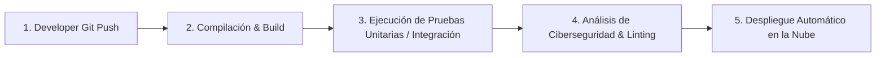

# 🚀 Red & Bridge B2B Marketplace — Plataforma de Conexión de Insumos y Proveedores

> **Plataforma Fullstack B2B** construida con **Spring Boot 3 (Java 21)**, **React (Vite + Tailwind CSS)** y **PostgreSQL**, orquestada con **Docker**.
> Diseñada bajo principios de desarrollo ágil, co-creación Humano-AI y arquitectura escalable en capas.

---

## 📌 1. Visión y Filosofía del Proyecto

Este proyecto no es solo una landing page o un MVP plano; es un **Marketplace & Bridge B2B** diseñado para conectar directamente a fabricantes de empaques, cintas, vinipel y soluciones industriales con empresas y emprendedores compradores al por mayor.

### 🤝 Toque Humano + IA
- **La IA acelera la estructura y el boilerplate:** Genera configuraciones Maven, migraciones SQL iniciales y bindings de UI.
- **El Humano dirige las decisiones críticas:** Diseña el flujo de experiencia de usuario (UX), establece reglas de negocio, revisa la ciberseguridad, valida las reseñas reales de clientes y refina el código.

---

## 🏗️ 2. Lo que Hemos Construido Hasta Ahora

```text
proyecto-fullstack/
├── frontend/                        # SPA React 19 + Vite 8 + Tailwind CSS 4
│   ├── src/
│   │   ├── components/
│   │   │   ├── common/              # Button, Card, Badge, Input
│   │   │   ├── layout/              # Navbar (con slot Logo PNG), Footer
│   │   │   └── features/
│   │   │       ├── catalogo/        # ProveedorCard, FiltroCategoria
│   │   │       ├── perfil/          # ProductoCard, BotonContacto, ModalDisponibilidad, SeccionResenas
│   │   │       └── registro/        # FormularioProveedor (Single-step)
│   │   ├── pages/                   # LandingPage, PerfilProveedor, Registro
│   │   ├── services/                # proveedorService.js (Estrategia híbrida API Real <-> Fallback Mock)
│   │   └── data/                    # mockData.json (Semillas locales)
├── backend/                         # API REST Spring Boot 3 (Java 21)
│   ├── src/main/java/com/proveedores/
│   │   ├── config/                  # CorsConfig
│   │   ├── entity/                  # Categoria, Proveedor, Producto, Resena, ClickContacto (JPA)
│   │   ├── repository/              # Spring Data JPA Repositories
│   │   ├── service/                 # CategoriaService, ProveedorService, ResenaService
│   │   ├── observer/                # ContactoEventPublisher & EstadisticasObserver (Patrón Observer)
│   │   └── controller/              # CategoriaController, ProveedorController, ResenaController, ContactoController
│   ├── Dockerfile                   # Multi-stage build (Maven compile -> JRE 21 Alpine)
│   └── pom.xml                      # Dependencias Maven (Spring Web, Data JPA, Postgres, Lombok)
└── docker-compose.yml               # Orquestación (PostgreSQL 16 + Backend Spring Boot + Frontend React)
```

---

## 🛠️ 3. Conceptos Clave de Arquitectura & DevOps Explicados

### A. ¿Qué son los Pipelines de CI/CD?
Un **Pipeline de CI/CD** (Integración Continua y Despliegue Continuo) es una secuencia automatizada de pasos que se ejecuta cada vez que haces `git push` a tu repositorio.



> **¿Por qué los Tests van ANTES de subir a producción?**
> Si subes un código roto directamente a producción, tus usuarios verán pantallas blancas o fallos de pago. El pipeline frena el despliegue si algún test unitario falla.

---

### B. Red Hat, Contenedores y Pods (Las "Cajitas")
Cuando escuchas sobre Red Hat (OpenShift), Kubernetes o Docker:
- **Contenedor (Docker):** Es una "cajita" estandarizada que empaqueta tu código + dependencias + sistema operativo mínimo para que corra exactamente igual en tu PC que en la nube.
- **Pod (Red Hat OpenShift / Kubernetes):** Es la unidad mínima de ejecución. Un Pod puede contener uno o más contenedores que comparten la misma red e IP. Red Hat OpenShift es la plataforma empresarial que administra miles de estos Pods automáticamente (escalado, autoreparación si un Pod se cae, etc.).

---

### C. Observabilidad: Grafana vs Jaeger (Métricas vs Trazado)

| Herramienta | ¿Para qué sirve? | ¿Es necesaria en este MVP? | Diagnóstico / Recomendación |
|---|---|---|---|
| **Grafana** | Visualiza **Métricas del Sistema** en tableros gráficos (uso de CPU, RAM, peticiones HTTP/seg, errores 500). | 🟡 Opcional para arrancar, pero **muy valioso para tu CV**. | En Spring Boot es súper fácil integrar `spring-boot-starter-actuator` + Prometheus para alimentar Grafana. |
| **Jaeger** | **Trazado Distribuido (Distributed Tracing)**. Sigue el viaje de una sola petición HTTP desde que el usuario hace clic en React, pasa por Spring Boot, consulta la BD y regresa. | 🔴 No es indispensable para un MVP monocontenedor. | Jaeger brilla cuando tienes **decenas de microservicios**. Para este monolito en capas, añade complejidad y consumo de RAM innecesario en desarrollo local. |

---

## 🔒 4. Hoja de Ruta de Ciberseguridad & Autenticación (Próximos Pasos)

### ¿Por qué Spring Boot es la mejor elección para tu CV?
Spring Boot es el estándar absoluto en banca, empresas corporativas y desarrollo B2B por su robustez en **Spring Security**, su fuerte tipado en Java y su rendimiento.

### Próxima Fase: Autenticación JWT en el Backend
1. **Spring Security + JWT (JSON Web Tokens):**
   - El proveedor se autentica en `/api/auth/login`.
   - El servidor retorna un Token JWT firmado con clave secreta.
   - En peticiones protegidas (`POST /api/proveedores/mis-productos`), el frontend envía el token en el Header `Authorization: Bearer <token>`.
2. **Encriptación de Contraseñas:**
   - Uso de `BCryptPasswordEncoder` para nunca almacenar contraseñas en texto plano en PostgreSQL.

---

## 🙋‍♂️ 5. Cómo Puedes Aportar tu Toque Humano al Código

Para que el proyecto sea 100% tuyo y aporte un valor humano real:

1. **Refina la Lógica de Negocio en Java (`service/`):**
   - Abre `backend/src/main/java/com/proveedores/service/ProveedorService.java` y añade reglas de validación personalizadas (ej. validar formato de WhatsApp colombiano, filtros especiales por ciudad).
2. **Escribe Pruebas Unitarias (`src/test/java/`):**
   - Agrega tests con JUnit 5 y Mockito para probar que tus repositorios y servicios respondan correctamente.
3. **Crea Componentes e Interacciones en React (`src/components/`):**
   - Ajusta estilos, añade nuevas micro-animaciones o integra tu logo oficial en `/public/logo.png`.

---

## 🚦 6. Cómo Levantar el Proyecto Localmente

### Con Docker Compose (Recomendado):
```bash
docker compose up --build
```
- **Frontend React:** `http://localhost:5173`
- **Backend Spring Boot REST API:** `http://localhost:8000/api`
- **Base de Datos PostgreSQL:** `localhost:5432`

---

## 📋 7. Fases del Proyecto

- [x] **Fase 1:** Configuración base de la estructura Monorepo y sistema de diseño UI (React + Tailwind).
- [x] **Fase 2:** Mock Data B2B y capa de servicio desacoplada.
- [x] **Fase 3:** Vistas interactivas (Landing, Perfil Proveedor, Modal de Disponibilidad, Reseñas).
- [x] **Fase 4:** Arquitectura Backend en Capas con Spring Boot 3 + PostgreSQL JPA + Patrón Observer.
- [ ] **Fase 5:** Autenticación de Usuarios y Proveedores con Spring Security + JWT.
- [ ] **Fase 6:** Pipeline CI/CD en GitHub Actions y Despliegue $0 en Firebase Hosting + Supabase DB.
